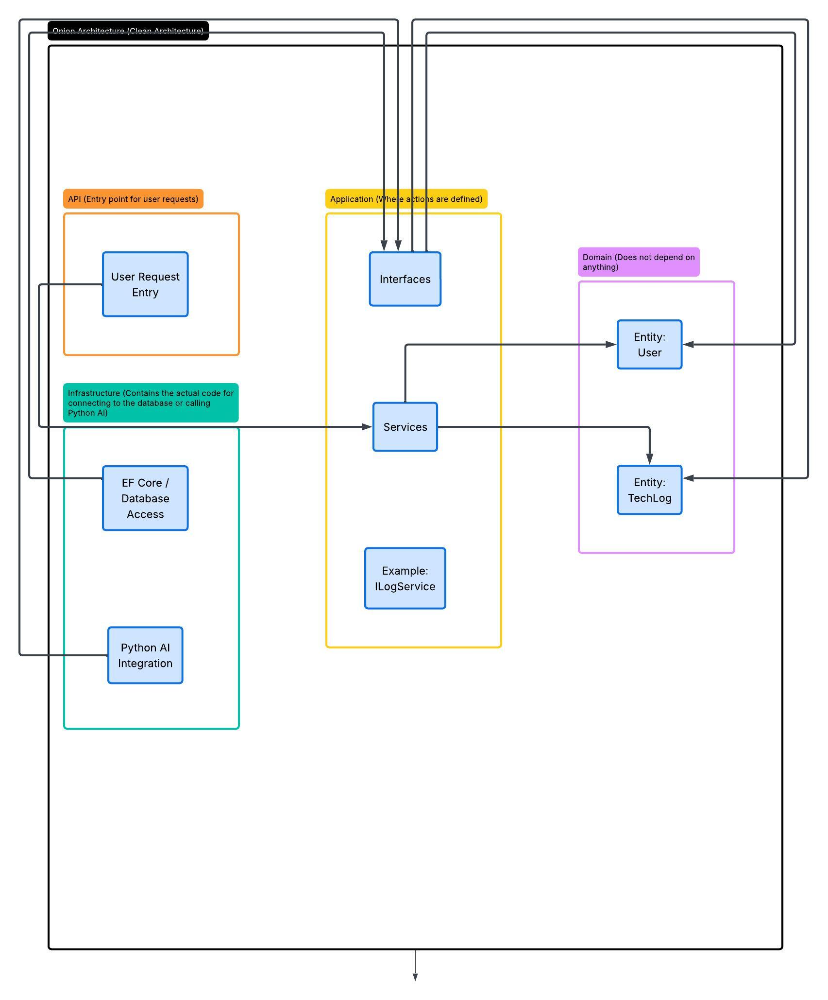
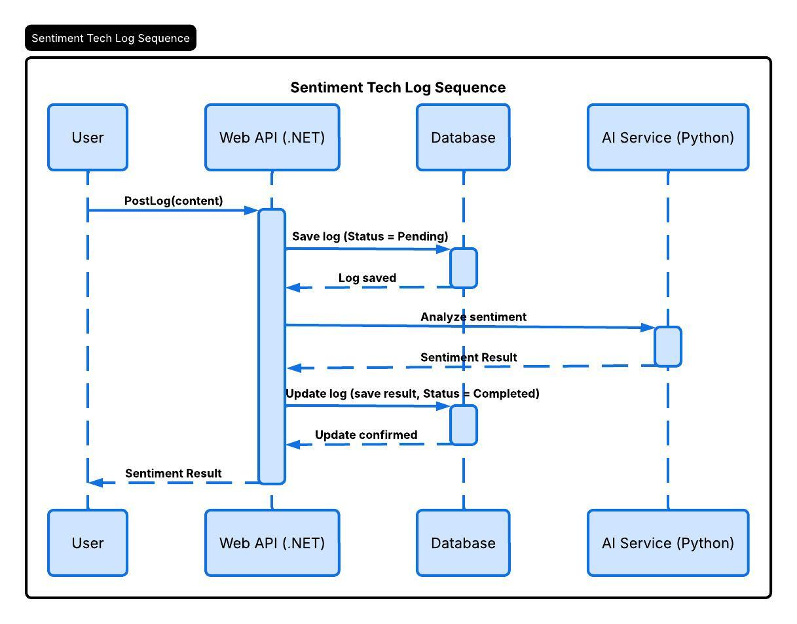
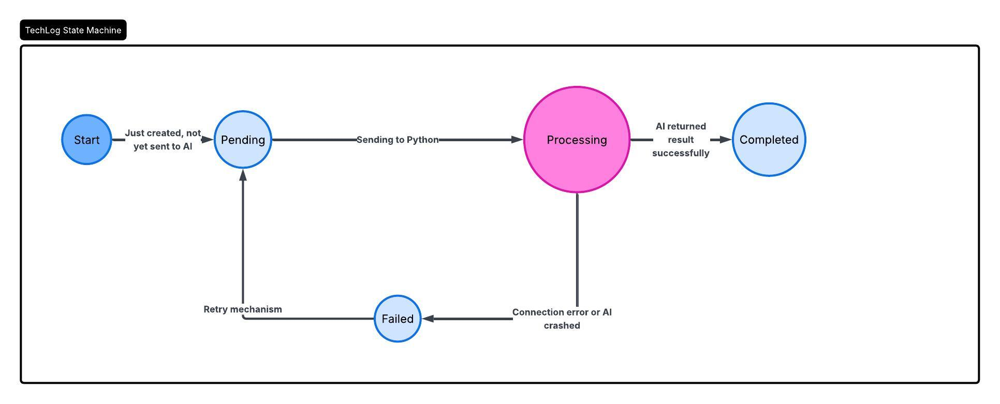

```markdown
# Sentimental Tech-Log & AI Career Advisor

**A professional full-stack ecosystem to track technical growth and emotional resilience.**

## 🏗 System Architecture
This project implements **Clean Architecture** to ensure high maintainability and testability.

### 1. Component Diagram


### 2. Sequence Diagram (Data Flow)


### 3. State Machine (Log Lifecycle)


## 🛠 Tech Stack
- **Backend:** .NET 8/9, ASP.NET Core Web API
- **AI Engine:** Python (FastAPI), NLP Transformers
- **Database:** PostgreSQL (with JSONB support)
- **DevOps:** GitHub Actions, Docker, Azure App Service

## 🚀 Key Features
- **Sentiment Analysis:** Real-time emotional tracking for developers.
- **Decoupled Architecture:** Independent scaling for AI and Web services.
- **Resilient Processing:** State-based retry mechanism for AI inference.
